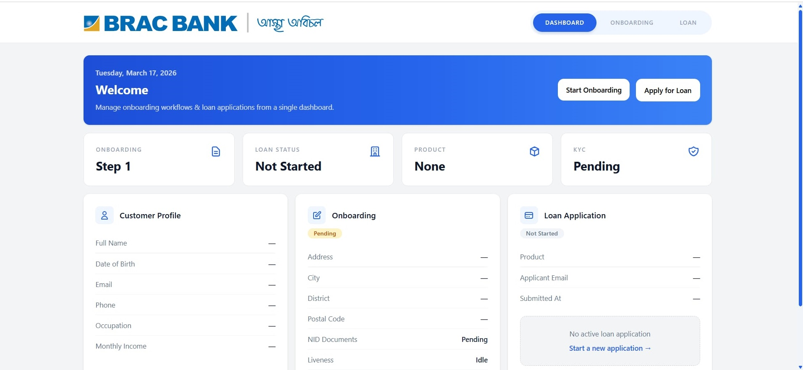
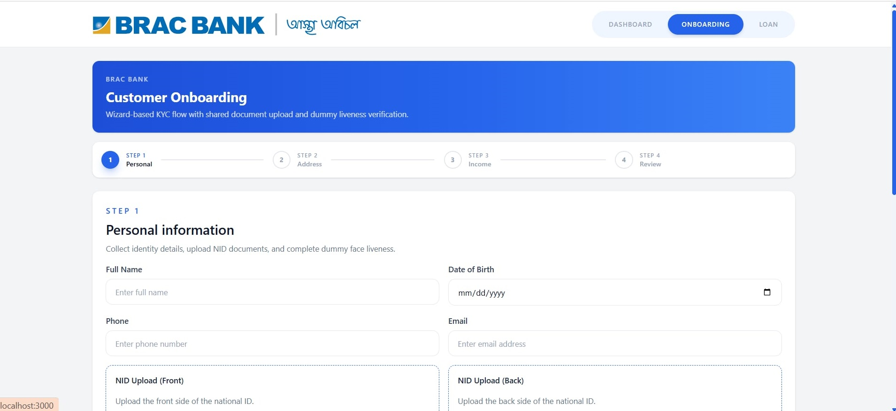
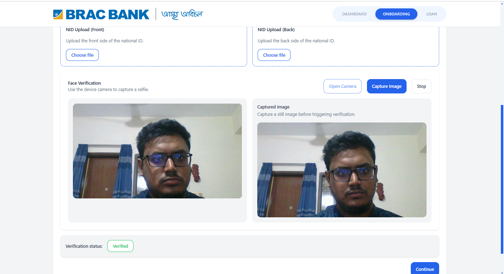
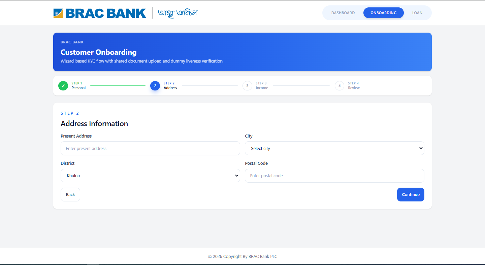
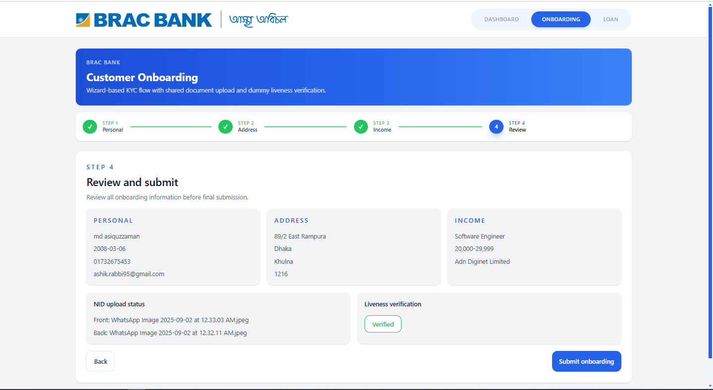
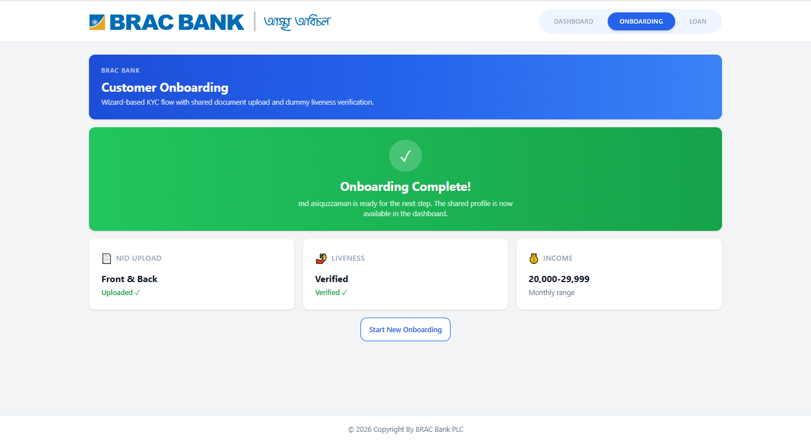
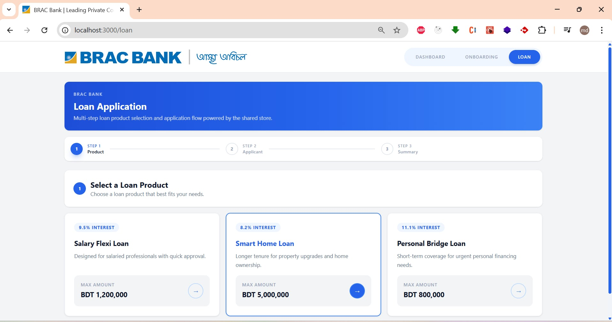
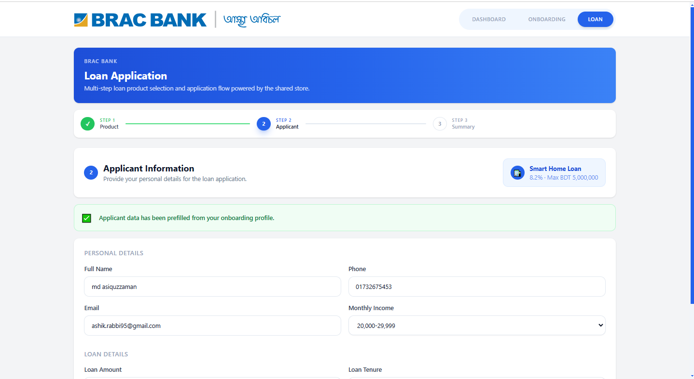
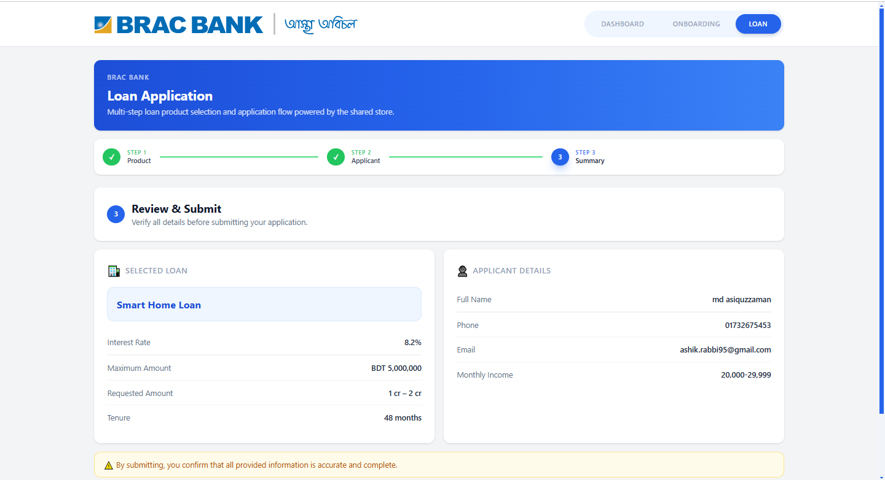
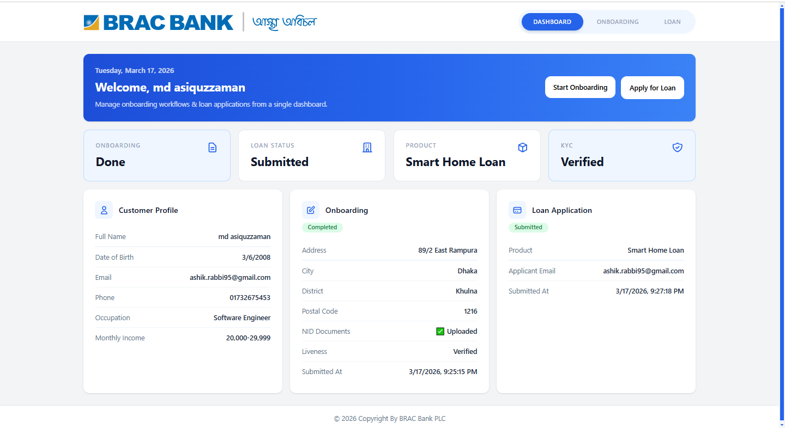

# Banking Micro-Frontend Assignment


A pnpm workspace monorepo containing:

- `apps/app-shell`
- `apps/loan-mfe`
- `apps/onboarding-mfe`
- `packages/ui-library`
- `packages/store`

The implementation includes Vite Module Federation, TailwindCSS, a shared UI library, a shared Zustand store, lazy loaded micro-frontends, wizard-based onboarding, and a multi-step loan flow.

## Run

```bash
pnpm install
pnpm dev
```

## Ports

- `app-shell`: `http://localhost:3000`
- `loan-mfe`: `http://localhost:3001`
- `onboarding-mfe`: `http://localhost:3002`

## Build

```bash
pnpm build
```

## Preview













